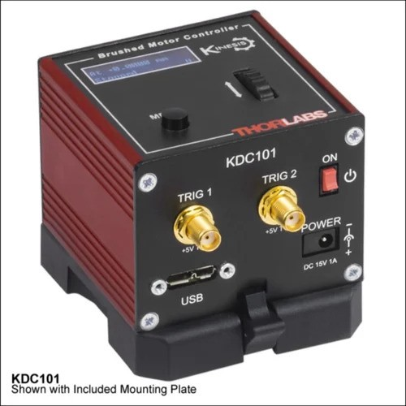
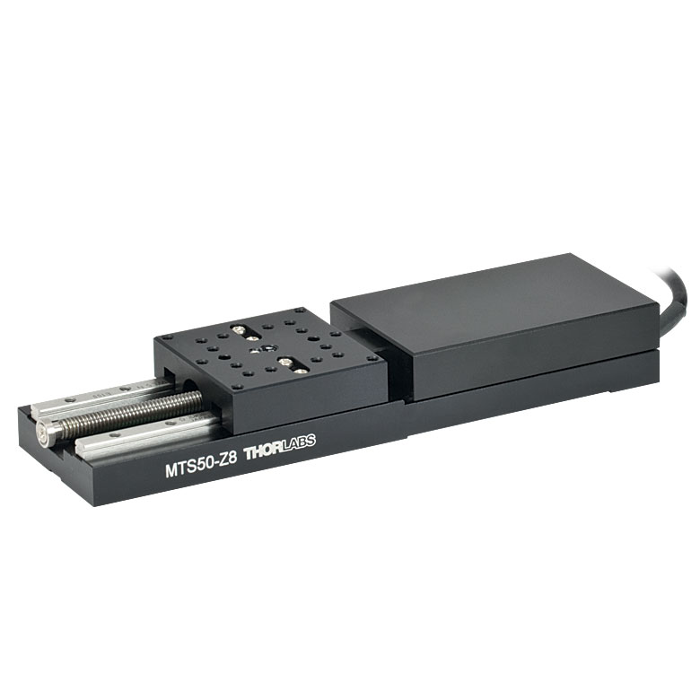

# **KDC101**

## Controller Description
The **KDC101** is a compact **single-channel** K-Cube controller from Thorlabs designed for **precise control of DC motors**. It is optimized for positioning applications requiring accurate and smooth motion control. The KDC101 supports bidirectional DC motor control with adjustable speed, acceleration, and position settings. It features USB connectivity for computer control via Thorlabs’ Kinesis Software or [QuantumION's Thorlabs Cube Repository](https://github.com/quantumion/thorlabs_cube).

## Controller Use-Cases
* **KDC101** is used in applications requiring fine motorized adjustments, such as:
	1.	**Optical Alignment**: Precise positioning of lenses, mirrors, and other optical components.
	2.	**Microscopy**: Fine control of motorized stages for specimen alignment or focusing.
	3.	**Laser Systems**: Stabilizing or adjusting optical components in beam paths.

## Peripherals Examples
* **DC Motor Actuators**

* **Motorized Mirror Mounts**

* **Motorized Stages**

## **API Reference**
### ::: thorlabs_cube.driver.kcube.kdc.Kdc
