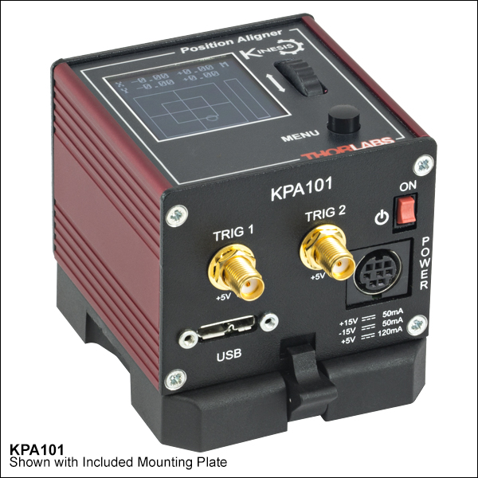
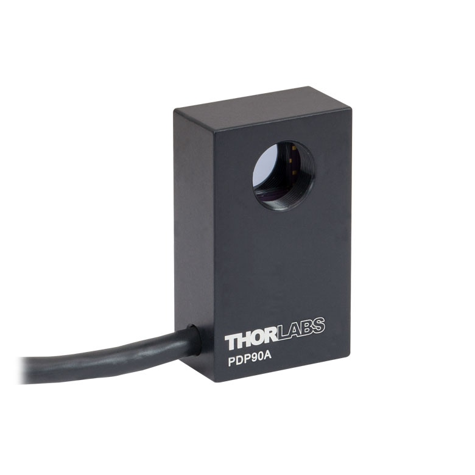

# **KPA101**

## Controller Description
The **KPA101** is a compact **single-channel** K-Cube controller from Thorlabs designed for **automatic alignment of optical components using Position-Sensitive Detectors (PSDs)**. It provides real-time, feedback-based control for high-precision optical alignment tasks. The KPA101 is ideal for dynamic alignment in optical systems and integrates seamlessly with Thorlabs’ PSDs and alignment peripherals. It features USB connectivity for computer control via Thorlabs’ Kinesis Software or [QuantumION's Thorlabs Cube Repository](https://github.com/quantumion/thorlabs_cube).

## Controller Use-Cases
* **KPA101** is used in applications requiring automated optical alignment, such as:
	1.	**Beam Stabilization**: Maintaining optical beam alignment during system operation.
	2.	**Optical System Setup**: Automating the alignment of optical components like lenses and mirrors.
	3.	**Laser Systems**: Dynamic alignment of laser beams for stability and throughput optimization.

## Peripherals Examples
* **Position-Sensitive Detectors**

* **Motorized Mirror Mounts**

* **Auto-Aligning Modules**

## **API Reference**
### ::: thorlabs_cube.driver.kcube.kpa.Kpa
