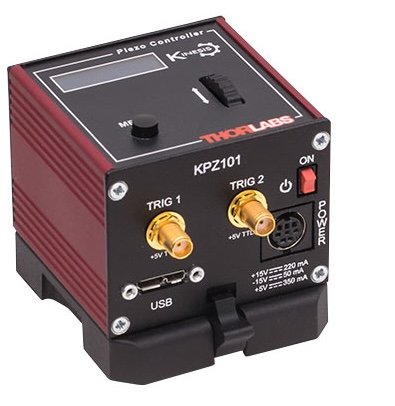
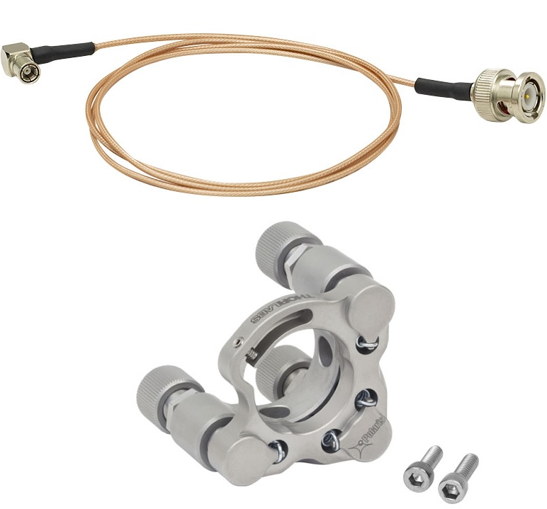
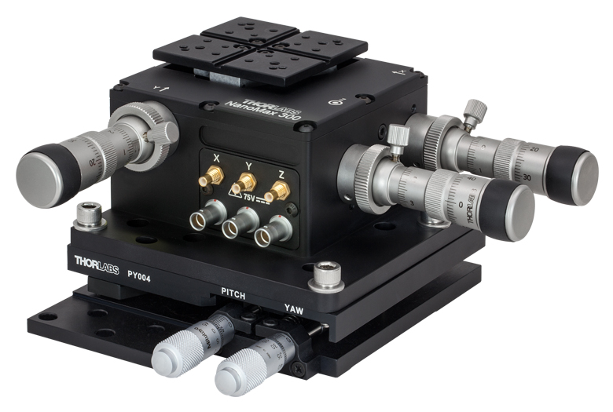

# **KPZ101**

## Controller Description
The **KPZ101** is a compact **single-channel** K-Cube controller from Thorlabs designed for **precise control of piezoelectric actuators**. It provides high-resolution control with nanometer-level precision, making it ideal for applications requiring ultra-fine positioning adjustments. The KPZ101 supports closed-loop operation with feedback from piezo sensors and features USB connectivity for computer control via Thorlabs’ Kinesis Software or [QuantumION's Thorlabs Cube Repository](https://github.com/quantumion/thorlabs_cube).

## Controller Use-Cases
* **KPZ101** is commonly used in applications requiring high-precision motion control, such as:
	1.	**Nanopositioning**: Precise adjustments in optical systems.
	2.	**Interferometry**: Fine control of optical path lengths for measurement accuracy.
	3.	**Microscopy**: Sub-micron sample positioning and stage control.

## Peripherals Examples
* **Piezoelectric Actuators**

* **Piezo-Driven Mirror Mounts**

* **Piezo Translation Stages**

## **API Reference**
### ::: thorlabs_cube.driver.kcube.kpz.Kpz
