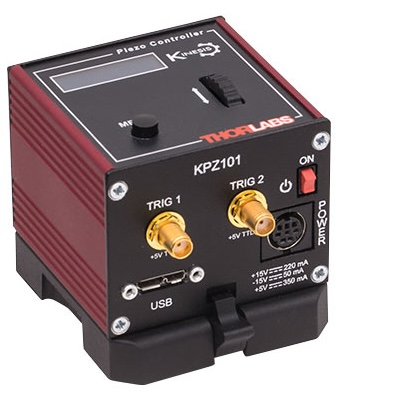
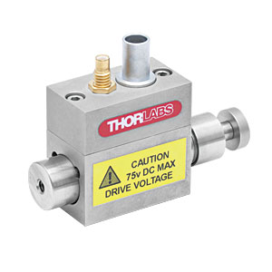
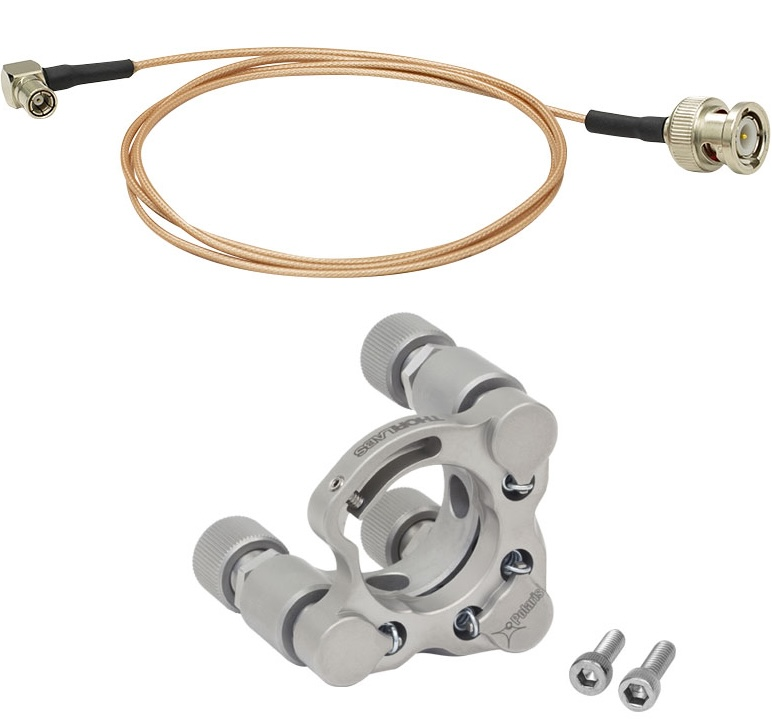
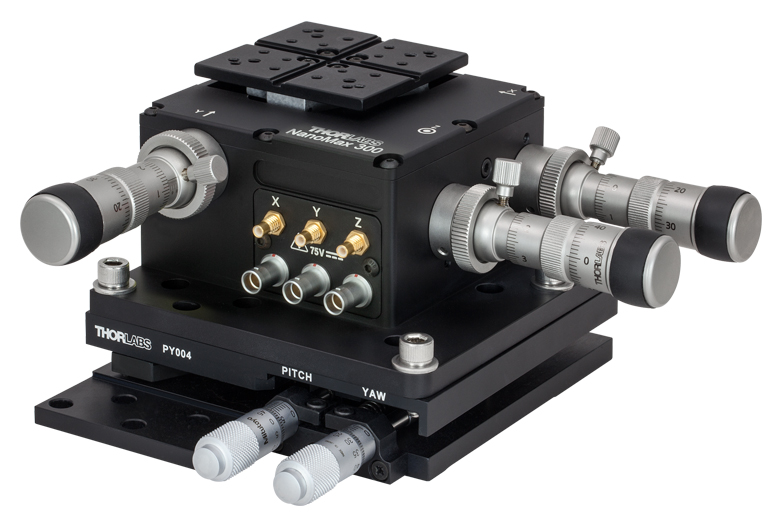

# **KPZ101**

## Controller Description

The [**KPZ101**](https://www.thorlabs.com/thorproduct.cfm?partnumber=KPZ101) is a compact **single-channel** K-Cube controller from Thorlabs designed for **precise control of piezoelectric actuators**.
It provides high-resolution control with nanometer-level precision, making it ideal for applications requiring ultra-fine positioning adjustments.
The KPZ101 supports closed-loop operation with feedback from piezo sensors and features USB connectivity for computer control via [Thorlabs' Kinesis Software](https://www.thorlabs.com/newgrouppage9.cfm?objectgroup_id=10285) or [QuantumION's Thorlabs Cube Repository](https://github.com/quantumion/thorlabs_cube).

## Controller Use-Cases

* **KPZ101** is commonly used in applications requiring high-precision motion control, such as:
1.**Nanopositioning**: Precise adjustments in optical systems.
2.**Interferometry**: Fine control of optical path lengths for measurement accuracy.
3.**Microscopy**: Sub-micron sample positioning and stage control.

## Peripherals Examples

* **[Piezoelectric Actuators](https://www.thorlabs.com/newgrouppage9.cfm?objectgroup_id=5023)**

* **[Piezo-Driven Mirror Mounts](https://www.thorlabs.com/newgrouppage9.cfm?objectgroup_id=2363)**

* **[Piezo Translation Stages](https://www.thorlabs.com/newgrouppage9.cfm?objectgroup_id=2432)**

## **API Reference**

### ::: thorlabs_cube.driver.kcube.kpz.Kpz
