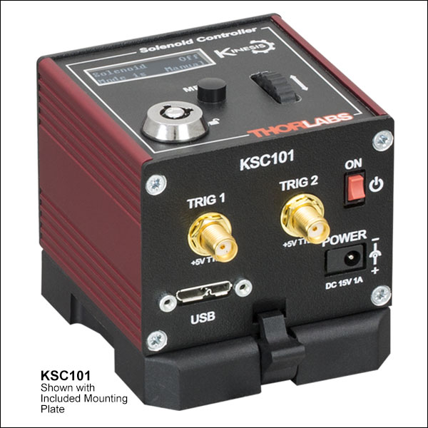

# **KSC101**

## Controller Description
The **KSC101** is a compact **single-channel** K-Cube controller from Thorlabs designed for **precise control of solenoids**. It enables accurate and reliable actuation of solenoids for applications that require controlled force or switching. The KSC101 provides adjustable current settings for solenoid operation and features USB connectivity for computer control via Thorlabs’ Kinesis Software or [QuantumION's Thorlabs Cube Repository](https://github.com/quantumion/thorlabs_cube).

## Controller Use-Cases
* **KSC101** is used in applications requiring precise solenoid actuation, such as:
	1.	**Optical Shutters**: Controlled beam blocking or modulation in laser systems.
	2.	**Optomechanical Systems**: Switching optical paths with high accuracy.
	3.	**Industrial Automation**: Actuating mechanical locks or switches in precise operations.

## Peripherals Examples
* **Optical Shutters**

* **Motorized Flip Mounts**

## **API Reference**
### ::: thorlabs_cube.driver.kcube.ksc.Ksc
