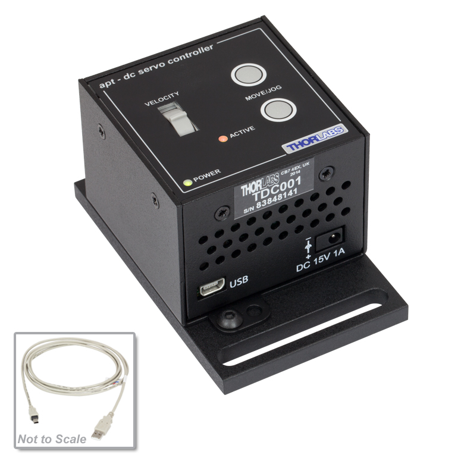

# **TDC001**

## Controller Description
The **TDC001** is a compact **single-channel** T-Cube controller from Thorlabs designed for **precise control of DC servo motors**. It is commonly used for positioning applications requiring fine adjustments. The TDC001 supports bidirectional motor control, with adjustable speed and position settings, and is compatible with Thorlabs’ DC servo actuators. It features USB connectivity for computer control via Thorlabs’ Kinesis Software or [QuantumION's Thorlabs Cube Repository](https://github.com/quantumion/thorlabs_cube)

## Controller Use-Cases
* **TDC001** is used in applications requiring precise motion control, such as:
	1.	**Optical Alignment**: Positioning lenses, mirrors, or other optical components in labs and industrial setups.
	2.	**Microscopy**: Fine-tuning stages or focus mechanisms.
	3.	**Laser Systems**: Aligning and stabilizing beams in optical experiments.

## Peripherals Examples
* **DC Servo Actuators**

* **Motorized Mirror Mounts**

* **Motorized Stages**

## **API Reference**
### ::: thorlabs_cube.driver.tcube.tdc.Tdc
