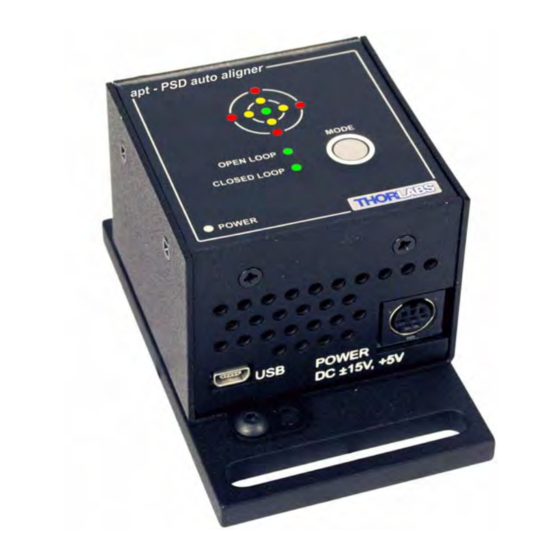
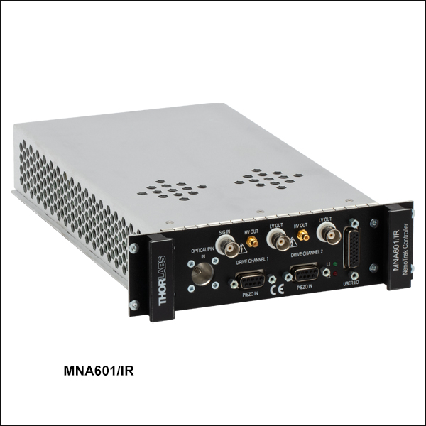

# **TPA101**

## Controller Description
The **TPA101** is a compact **single-channel** T-Cube controller from Thorlabs designed for **precise automatic alignment of optical components using Position-Sensitive Detectors (PSDs)**. It is typically used in optical systems requiring high-speed, real-time feedback-based alignment. The TPA101 is compatible with Thorlabs’ auto-alignment peripherals and features USB connectivity for computer control via Thorlabs’ Kinesis Software or [QuantumION's Thorlabs Cube Repository](https://github.com/quantumion/thorlabs_cube).

## Controller Use-Cases
* **TPA101** is used in applications where precise optical alignment is essential, such as:
	1.	**Beam Stabilization**: Maintaining optical beam position stability over time.
	2.	**Optical Alignment Automation**: Real-time alignment of lenses, mirrors, and other optical elements.
	3.	**Laser Systems**: Dynamic alignment of laser beams for maximum throughput and precision.

## Peripherals Examples
* **Position-Sensitive Detectors**

* **Motorized Mirror Mounts**

* **Auto-Aligning Modules**

## **API Reference**
### ::: thorlabs_cube.driver.tcube.tpa.Tpa
