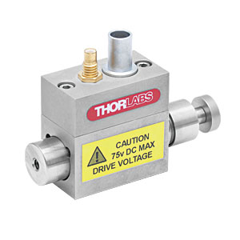

# **TPZ001**

## Controller Description
The **TPZ001** is a compact **single-channel** T-Cube controller from Thorlabs designed for **precise control of piezoelectric actuators**. It provides highly accurate position control for applications requiring nanometer-level precision. The TPZ001 supports closed-loop operation with feedback from piezo sensors and is compatible with Thorlabs’ piezo actuators. It features USB connectivity for computer control via Thorlabs’ Kinesis Software or [QuantumION's Thorlabs Cube Repository](https://github.com/quantumion/thorlabs_cube).

## Controller Use-Cases
* **TPZ001** is ideal for applications requiring ultra-fine positioning, such as:
	1.	**Nanopositioning**: High-precision adjustments of optical components.
	2.	**Interferometry**: Fine control of optical path lengths for precision measurements.
	3.	**Microscopy**: Managing piezo-driven sample stages for sub-micron positioning.

## Peripherals Examples
* **Piezoelectric Actuators**

* **Piezo-Driven Mirror Mounts**

* **Piezo Translation Stages**

## **API Reference**
### ::: thorlabs_cube.driver.tcube.tpz.Tpz
