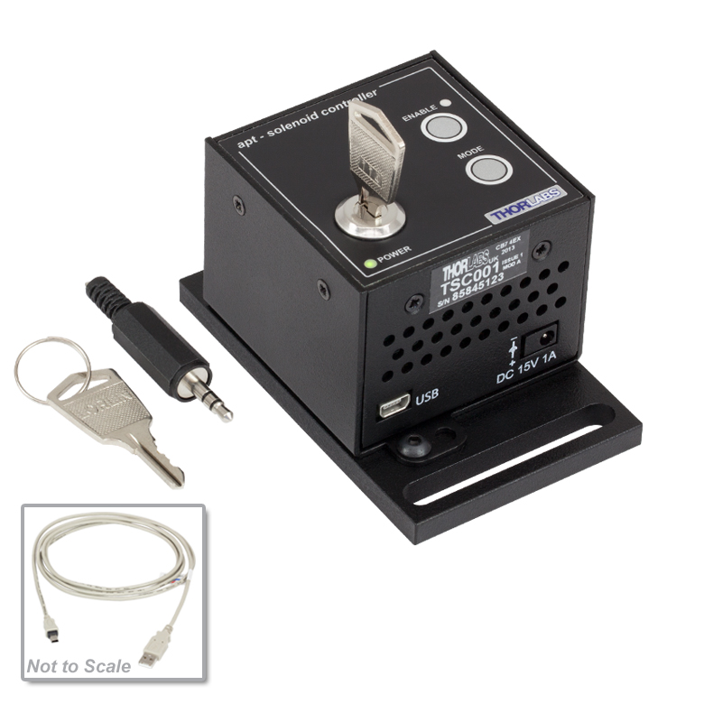
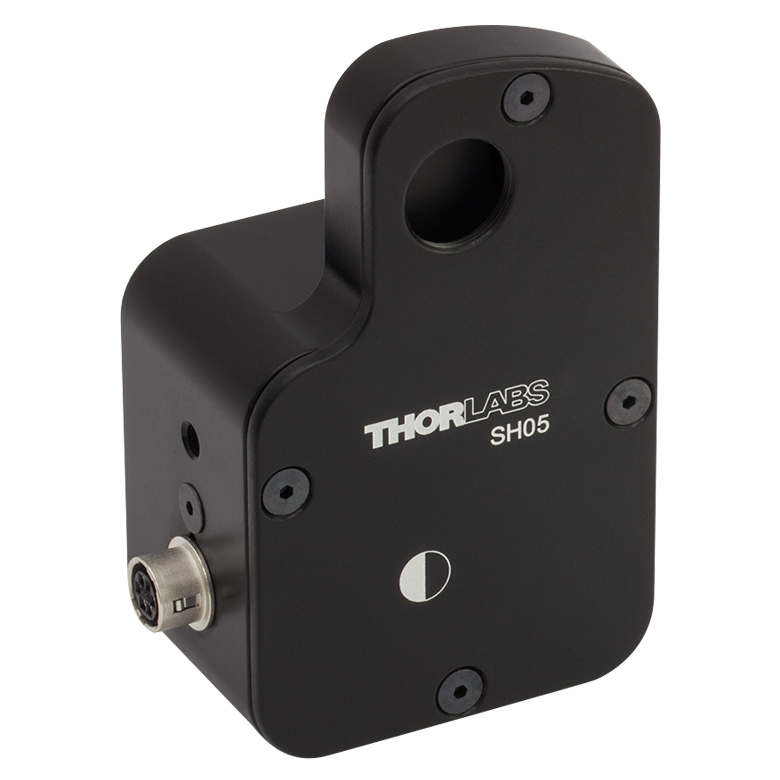

# **TSC001**

## Controller Description
The **TSC001** is a compact **single-channel** T-Cube controller from Thorlabs designed for **precise control of solenoids**. It enables smooth and accurate actuation of solenoids, making it ideal for applications requiring controlled switching or force actuation. The TSC001 provides adjustable current settings for solenoid operation and features USB connectivity for computer control via Thorlabs’ Kinesis Software or [QuantumION's Thorlabs Cube Repository](https://github.com/quantumion/thorlabs_cube).

## Controller Use-Cases
* **TSC001** is commonly used in applications requiring reliable solenoid actuation, such as:
	1.	**Optomechanical Systems**: Switching optical paths or shutters.
	2.	**Laser Systems**: Controlling mechanical shutters for beam blocking or modulation.
	3.	**Industrial Automation**: Actuating mechanical locks, switches, or small actuators.

## Peripherals Examples
* **Optical Shutters**

* **Motorized Flip Mounts**

## **API Reference**
### ::: thorlabs_cube.driver.tcube.tsc.Tsc
